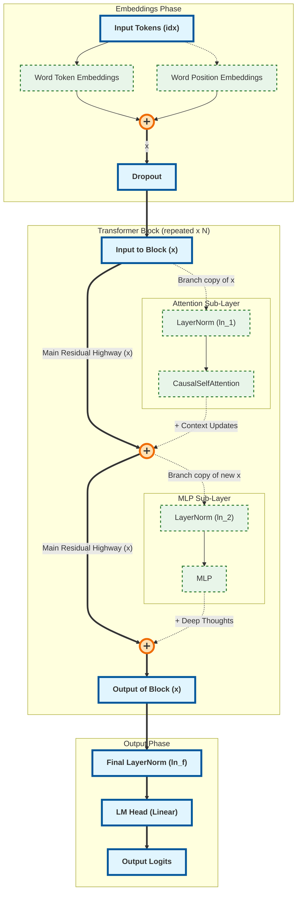

# nanoGPT Architecture

```mermaid
graph TD
    classDef highway fill:#e1f5fe,stroke:#01579b,stroke-width:4px,font-weight:bold;
    classDef side fill:#e8f5e9,stroke:#2e7d32,stroke-width:2px,stroke-dasharray: 5 5;
    classDef merge fill:#ffe0b2,stroke:#ef6c00,stroke-width:4px,font-size:20px;

    Input["Input Tokens (idx)"]:::highway
    
    subgraph "Embeddings Phase"
        direction TB
        WTE["Word Token Embeddings"]:::side
        WPE["Word Position Embeddings"]:::side
        Add_Emb(("➕")):::merge
        Drop["Dropout"]:::highway
        
        Input --> WTE
        Input -.-> WPE
        WTE --> Add_Emb
        WPE --> Add_Emb
        Add_Emb ==>|"x"| Drop
    end
    
    subgraph "Transformer Block (repeated x N)"
        direction TB
        
        Input_Block["Input to Block (x)"]:::highway
        Drop ==> Input_Block

        %% 1. The Main Unbroken Highway
        Add1(("➕")):::merge
        Add2(("➕")):::merge
        Output_Block["Output of Block (x)"]:::highway

        %% The massive unbroken vertical chain!
        Input_Block ==>|"Main Residual Highway (x)"| Add1
        Add1 ==>|"Main Residual Highway (x)"| Add2
        Add2 ==> Output_Block

        %% 2. The Attention Side-Branch
        subgraph "Attention Sub-Layer"
            direction TB
            LN1["LayerNorm (ln_1)"]:::side
            Attn["CausalSelfAttention"]:::side
            LN1 --> Attn
        end
        Input_Block -.->|"Branch copy of x"| LN1
        Attn -.->|"+ Context Updates"| Add1
        
        %% 3. The MLP Side-Branch
        subgraph "MLP Sub-Layer"
            direction TB
            LN2["LayerNorm (ln_2)"]:::side
            MLP["MLP"]:::side
            LN2 --> MLP
        end
        Add1 -.->|"Branch copy of new x"| LN2
        MLP -.->|"+ Deep Thoughts"| Add2
        
    end
    
    subgraph "Output Phase"
        direction TB
        LN_F["Final LayerNorm (ln_f)"]:::highway
        LM_Head["LM Head (Linear)"]:::highway
        Logits["Output Logits"]:::highway
        
        Output_Block ==> LN_F
        LN_F ==> LM_Head
        LM_Head ==> Logits
    end
```
