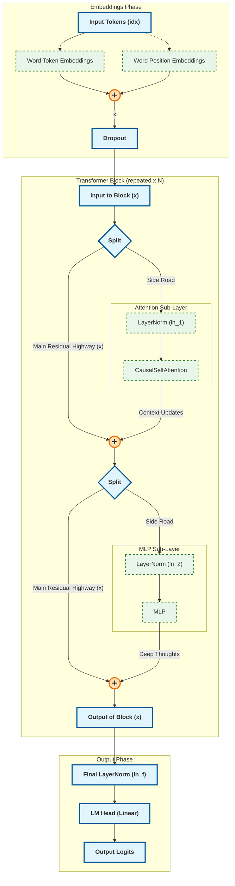

# nanoGPT Architecture

```mermaid
graph TD
    classDef main fill:#e1f5fe,stroke:#01579b,stroke-width:3px,font-weight:bold;
    classDef side fill:#e8f5e9,stroke:#2e7d32,stroke-width:2px,stroke-dasharray: 5 5;
    classDef merge fill:#ffe0b2,stroke:#ef6c00,stroke-width:3px,font-size:20px;

    Input["Input Tokens (idx)"]:::main
    
    subgraph "Embeddings Phase"
        direction TB
        WTE["Word Token Embeddings"]:::side
        WPE["Word Position Embeddings"]:::side
        Add_Emb(("➕")):::merge
        Drop["Dropout"]:::main
        
        Input --> WTE
        Input -.-> WPE
        WTE --> Add_Emb
        WPE --> Add_Emb
        Add_Emb -->|"x"| Drop
    end
    
    subgraph "Transformer Block (repeated x N)"
        direction TB
        
        Input_Block["Input to Block (x)"]:::main
        Drop --> Input_Block

        %% ATTENTION BRANCH
        Fork1{"Split"}:::main
        Input_Block --> Fork1
        
        %% The main residual highway bypasses Attention
        Fork1 --->|"Main Residual Highway (x)"| Add1
        
        %% The side road into Attention
        subgraph "Attention Sub-Layer"
            direction TB
            LN1["LayerNorm (ln_1)"]:::side
            Attn["CausalSelfAttention"]:::side
        end
        Fork1 --->|"Side Road"| LN1
        LN1 --> Attn
        
        %% Merge back to highway
        Add1(("➕")):::merge
        Attn --->|"Context Updates"| Add1
        
        %% MLP BRANCH
        Fork2{"Split"}:::main
        Add1 --> Fork2
        
        %% The main residual highway bypasses MLP
        Fork2 --->|"Main Residual Highway (x)"| Add2
        
        %% The side road into MLP
        subgraph "MLP Sub-Layer"
            direction TB
            LN2["LayerNorm (ln_2)"]:::side
            MLP["MLP"]:::side
        end
        Fork2 --->|"Side Road"| LN2
        LN2 --> MLP
        
        %% Merge back to highway
        Add2(("➕")):::merge
        MLP --->|"Deep Thoughts"| Add2
        
        Output_Block["Output of Block (x)"]:::main
        Add2 --> Output_Block
    end
    
    subgraph "Output Phase"
        direction TB
        LN_F["Final LayerNorm (ln_f)"]:::main
        LM_Head["LM Head (Linear)"]:::main
        Logits["Output Logits"]:::main
        
        Output_Block --> LN_F
        LN_F --> LM_Head
        LM_Head --> Logits
    end
```
