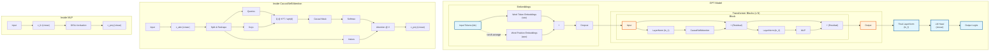

# nanoGPT Architecture

```mermaid
graph TD
    classDef main fill:#e1f5fe,stroke:#01579b,stroke-width:2px;
    classDef block fill:#fff3e0,stroke:#e65100,stroke-width:2px;
    classDef default font-family:Arial,font-size:14px;

    subgraph "GPT Model"
        Input["Input Tokens (idx)"]:::main
        
        subgraph "Embeddings"
            WTE["Word Token Embeddings<br>(wte)"]
            WPE["Word Position Embeddings<br>(wpe)"]
            Add["+"]
            Drop["Dropout"]
            
            Input --> WTE
            Input -.-> |"torch.arange"| WPE
            WTE --> Add
            WPE --> Add
            Add --> Drop
        end
        
        subgraph "Transformer Blocks (x N)"
            direction TB
            Input_Block["Input"]:::block
            
            subgraph "Block"
                LN1["LayerNorm (ln_1)"]
                Attn["CausalSelfAttention"]
                Add1["+ (Residual)"]
                LN2["LayerNorm (ln_2)"]
                MLP["MLP"]
                Add2["+ (Residual)"]
                
                Input_Block --> LN1
                Input_Block --> Add1
                LN1 --> Attn
                Attn --> Add1
                
                Add1 --> LN2
                Add1 --> Add2
                LN2 --> MLP
                MLP --> Add2
            end
            Output_Block["Output"]:::block
            Add2 --> Output_Block
        end
        
        Drop --> Input_Block
        
        LN_F["Final LayerNorm<br>(ln_f)"]:::main
        LM_Head["LM Head<br>(Linear)"]:::main
        Logits["Output Logits"]:::main
        
        Output_Block --> LN_F
        LN_F --> LM_Head
        LM_Head --> Logits
    end

    %% Internal details of components
    subgraph "Inside CausalSelfAttention"
        direction LR
        Attn_In["Input"]
        C_Attn["c_attn (Linear)"]
        Split["Split & Reshape"]
        Q["Queries"]
        K["Keys"]
        V["Values"]
        Dot["Q @ K^T / sqrt(d)"]
        Mask["Causal Mask"]
        Softmax["Softmax"]
        Context["Attention @ V"]
        C_Proj["c_proj (Linear)"]
        
        Attn_In --> C_Attn
        C_Attn --> Split
        Split --> Q
        Split --> K
        Split --> V
        
        Q --> Dot
        K --> Dot
        Dot --> Mask
        Mask --> Softmax
        Softmax --> Context
        V --> Context
        Context --> C_Proj
    end

    subgraph "Inside MLP"
        direction LR
        MLP_In["Input"]
        FC["c_fc (Linear)"]
        GELU["GELU Activation"]
        Proj["c_proj (Linear)"]
        
        MLP_In --> FC
        FC --> GELU
        GELU --> Proj
    end
```
